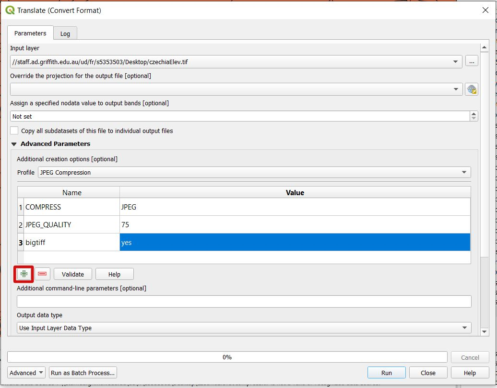

  

  <em>QGIS plugin utilizing Maxent for predictive modelling.</em>

---
## Documentation:

**Code**: [github.com/Scotsman1973/archaeo_modelling](https://github.com/Scotsman1973/archaeo_modelling/blob/main/archaeo_modelling.zip)

---

---
**General introduction** 
The following documentation gives workflows specific to this plugin, a QGIS resource section and instuctions on installing it from a '.zip' file.

---
**Dependancies and instalation from zip file** 
This plugin requires QGIS >= 3.0 and Python >= 3.0, and geopandas, rasterio and elapid Python packages installed via the OSGeo4W Shell. 
Download the repository from Zenodo and unzip, but leave 'archaeoModelling.zip' as zip file.  Open QGIS desktop and navigate to 'plugins' on the toolbar. 
Click on 'Manage and install plugins' then in that menu, 'install from ZIP'.  Choose the file, click install and ignore warning.

---
**QGIS resources** 
GIS, be it QGIS or ArcGIS, is a package of geospatial functions that uses common data types, so skills are very transferable.  These are intorductory courses, teaching all QGIS skills necessary to use this plugin.  Otherise, Google.
 
Webpages
[Spatial thoughts](https://courses.spatialthoughts.com/introduction-to-qgis.html)
[GIS librarian](https://www.geographyrealm.com/role-gis-librarians/)
 
Youtube sites
[Klas Karlsson](https://www.youtube.com/channel/UCxs7cfMwzgGZhtUuwhny4-Q)

---
**Data types**

---
**Using rasters created in GIS** 
Rasters must be in the .tif (geotif) format, then placed in the directory nominated using the GUI.  When this simple procedure is followed, outputs from QGIS (or ArcGIS) tools, including the raster calculator, can be used as inputs for modelling.

---
**elevation data**

---
**slope data**

---
**aspect data**

---
**huge file size**
Reducing raster file size can be achieved two ways, by increasing pixel size or using compression algorithms.  For compression, run the gdal translate processing tool.  JPEG compression reduces file size most, and still outputs a geotiff.  If the input file size is very big (>2Gb) use bigtiff=yes, as shown.  The processing tool, GRASS r.resample can be used to increase pixel size.

  

## Citation
Cite by including:
 
Andrew Prentice. (2024). Scotsman1973/archaeo_modelling: Initial test release (v1.alpha). Zenodo. https://doi.org/10.5281/zenodo.13160810

---
## Plugin created by Andrew Prentice
